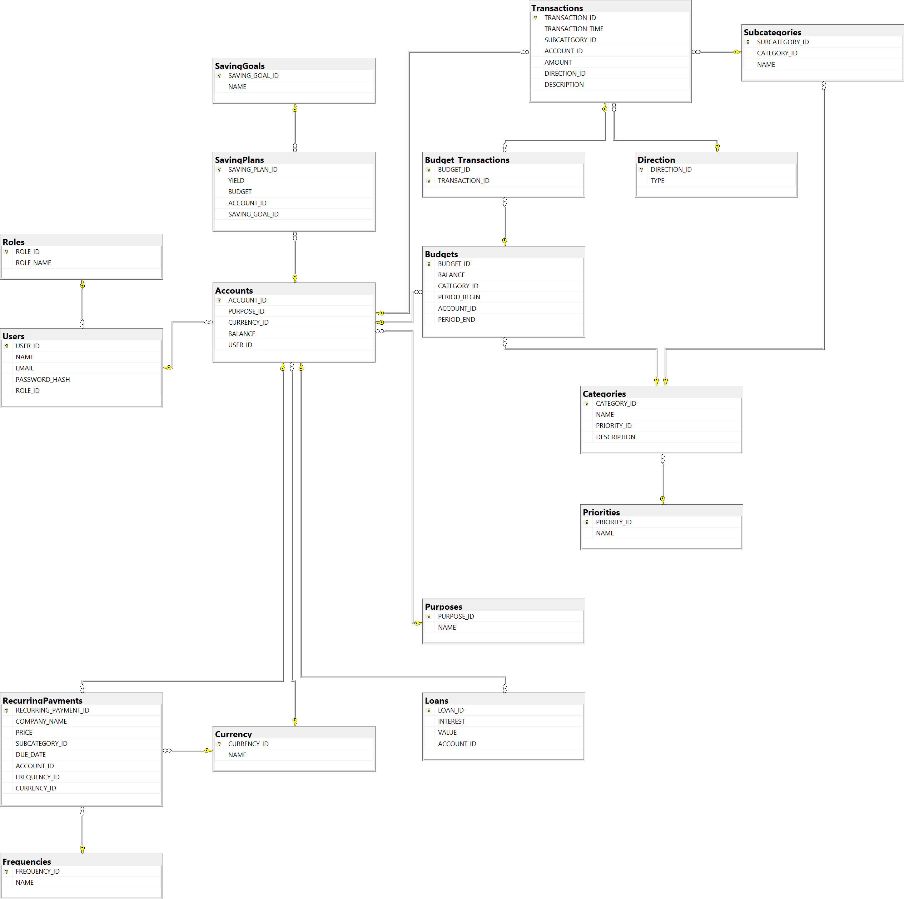

## DESCRIPTION

	This project is about using a database for storing data and using it for managing personal finance matters. Many users can use the application and have their data stored in one place with fast lookups. The DB was built with T-SQL connected with pyodbc. Argon2id was used to hash the passwords.

## INSERTING VALUES

	Some insert values may be changed. I recommend setting the foreign key references to numbers 1 to 10. If errors show up, the IDs may be changed.
	
## DEPENDENCIES

	To install the dependencies: pip install pyqt6 pyodbc argon2-cffi python-dotenv

## Database Architecture



## CREATING THE DATABASE

	There's a folder provided 'Revised_server_building' where the CREATE TABLE scripts are located and a modification which is 'Admin.sql' to add admin mode.
Also there are two ALTER TABLE statements to be run:

```sql
-- Automatically cascade account deletion when a user is deleted

ALTER TABLE Accounts 
DROP CONSTRAINT FK_Accounts_Users;

ALTER TABLE Accounts 
ADD CONSTRAINT FK_Accounts_Users 
FOREIGN KEY (USER_ID) REFERENCES Users(USER_ID) 
ON DELETE CASCADE;

-- Automatically cascade transaction deletion when an account is deleted

ALTER TABLE Transactions 
DROP CONSTRAINT FK_Transactions_Accounts;

ALTER TABLE Transactions 
ADD CONSTRAINT FK_Transactions_Accounts 
FOREIGN KEY (ACCOUNT_ID) REFERENCES Accounts(ACCOUNT_ID) 
ON DELETE CASCADE;